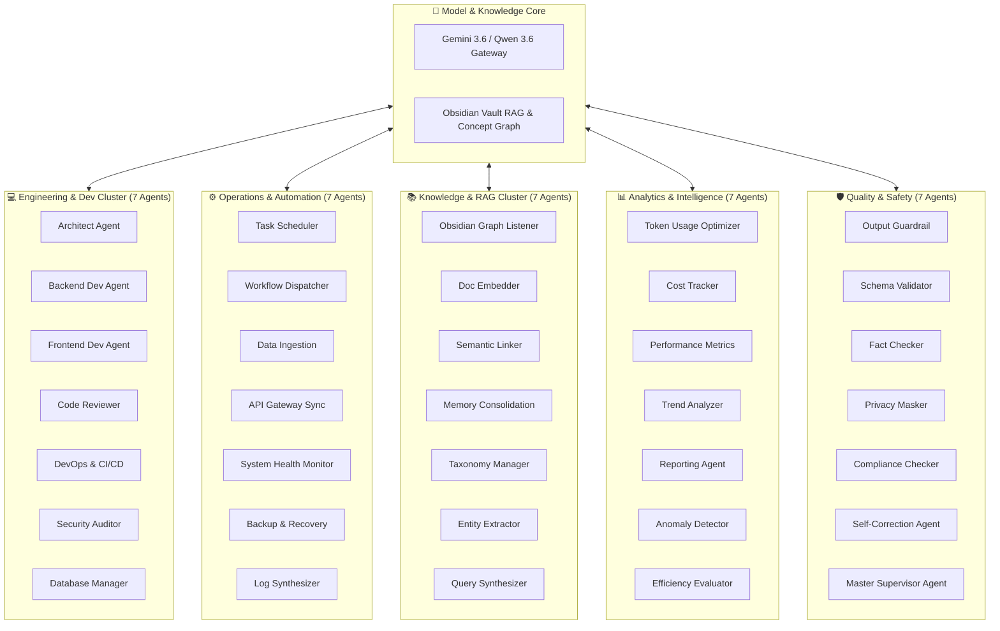

# 🌌 35 AI Agents Concept Graph & Enterprise Orchestration System

---

## 📌 Executive Summary

An enterprise-grade **Multi-Agent Orchestration Framework** inspired by continuous 24/7 AI workforce operations. This project visualizes, manages, and executes **35 autonomous AI agents** connected through a **Dynamic Concept Graph (Knowledge Graph)** integrated with **Obsidian Graph View** and Powered by **Gemini 3.6 / Qwen 3.6** reasoning engines.

Instead of isolated linear scripts, this system treats every AI agent, prompt, memory store, and business workflow as an interconnected node in an interactive graph.

---

## 🌟 Key Architectural Highlights

* **🕸️ Obsidian-Integrated Concept Graph:** Live bi-directional synchronization between local Obsidian Markdown Vaults and runtime agent states via WebSocket / Graph Protocol.
* **🧠 Gemini 3.6 & Qwen 3.6 Hybrid Engine:** Intelligent model routing balancing ultra-fast reasoning, low token costs, and high-context processing.
* **🤖 35 Specialized Autonomous Agents:** Organized into 5 core domain clusters (Engineering, Operations, RAG/Knowledge, Quality Control, and Analytics).
* **💸 Token Budget & Cost Guardrails:** Real-time token throttling and cost estimation ensuring continuous 24/7 operations stay within operational budget limits.
* **📊 Interactive Glassmorphism Dashboard:** Live visual monitoring of agent health, node dependencies, event queues, and graph topologies in HTML5/D3.js.

---

## 📐 System Topology & Cluster Taxonomy

---

## 🛠️ Tech Stack

| Layer | Technology |
| :--- | :--- |
| **Model Engine** | Gemini 3.6 Flash / Qwen 3.6 / Multi-LLM Router |
| **Graph Visualization** | Obsidian Graph View (Native) & D3.js / Canvas Web Dashboard |
| **State & Memory** | Vector Database (Chroma / Qdrant) + Obsidian Markdown Vault |
| **Orchestration** | Python / Node.js Multi-Agent Loop + WebSockets |
| **Security & Privacy** | Local PII Masking, Token Rate Limiters |

---

## 🚀 Quick Start & Interactive Dashboard

To launch the interactive Graph Dashboard & Implementation Plan:
1. Open [`index.html`](./index.html) in your browser.
2. Drag and explore the 35 AI agent nodes, inspect live dependencies, and view execution metrics.

---

## 📜 Documentation Links

- [📐 Detailed Architecture & Communication Protocols](./ARCHITECTURE.md)
- [🤖 Full 35-Agent Catalog & Subagent Workflows](./AGENTS_TAXONOMY.md)
- [🌐 Interactive HTML Dashboard](./index.html)
