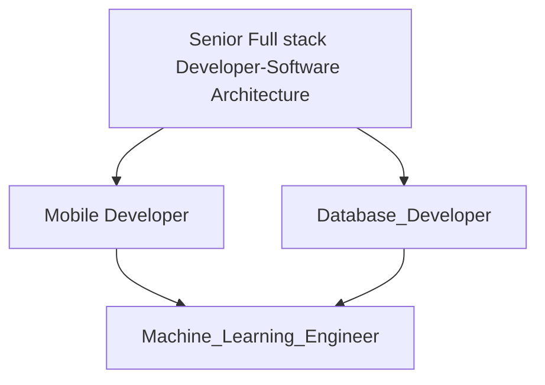
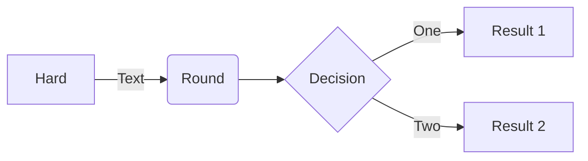
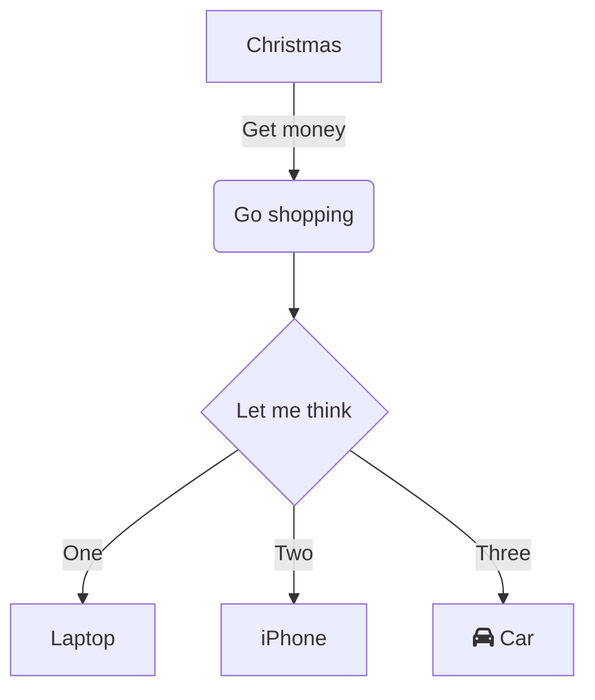
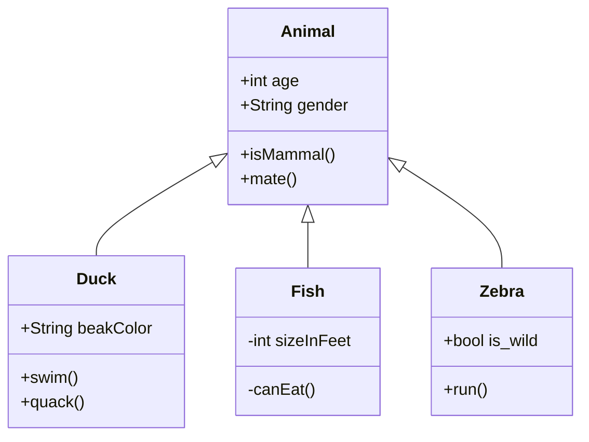

- <h1>👋 Hi There I’m   Mostafa  ElNagar (@saskw2010) </h1> <h3>
        
      (Senior Full stack Developer-Software Architecture/Mobile Developer/Database developer/Machine Learning engineer/System Architecture)

</h3>

  

	

 

 <h3> First Of All  I should to say I have excellent interpersonal skills and am passionate, creative,  dedicated, and more.</h3>
 <h3>Sure I'm friendly and always need to help others it makes me happy this is my passion do not hesitate to ask me, to hire me, to request help I will be there God bless all of you   </h3>
 

   

   <h3>
Over the past two decades, I have worked as a full-stack  Dot NET developer, I'm highly motivated, versatile,  and Multi-skilled, 
I have demonstrated expertise in software design and delivery covering large-scale cloud services, mobile apps, and on-premise software. I have a proven ability to identify and drive strategic programs from inception to launch and thrive in collaborative, team-oriented, and ambiguous environments. I'm an expert in analyzing, planning, architect, designing,  and developing software applications and systems that match business needs. I have many experiences to develop customized reporting and business intelligence solutions feeding on corporate solutions in order to assess an organization’s performance operationally and financially .

<h1>(I build Full Stack Solutions using a variety of Technologies  ⚡)</h1><h2>
         
		- C# - VB.net -  CSS -Javascript 🔥💜
 		- Blazor,Wasm  💜
	   	- .NET,.NET Core 💜
		- MAUI 🔥
 		- Xamarin 📱
 		- Python 🐍
		- ASP.NET
		- NET WinForms
		- Windows Service
		- Agile Software Methodolgy and Project Managment 
		- Development Lisfe Cycle (SDLC)
		- JavaScript,typescript
		- ASP.NET Core
		- SharePoint  
		- SQL
		- MySQL
		- SQLAzure
		- Knowing well (php,c++,java)
		- Knowing well (AWS,Azure,Google Cloud Services )
		- Knowing well (Sharepoint,Microsoft365,Active Directory (administration))
		- Knowing well (React 💻 , Angular 🌐,flutter,wordpress)
		- Knowing well (Clustring,Loadbalance,Virtualization,VMware,hyper-V)
	   
 			
</h2>
 I have worked with well-known corporations such as:
 
1- Zain Kuwait(MTC)
       
   	

  		 
 		 

		 
2-  Schlumberger  (SLB) 
   
      

  
  

  
   
  

  
 ## Github Stats :
 

  

  

  
  

  

  
  

    
 

 
  

  

    
    
    
  

 
 

<!---

<h1>  More About Me (Mostafa (A) ElNagar)   </h1>

 

--->

  <h3> Ai Optimal Enterprise solutions </h3>

 

- 🌱 I’m currently learning Build Ai APP applied NLP and Documents managment with Machine Learning ...
- 💞️ I’m looking to collaborate on Applied Machine Learning ON ERP Solutions...
- 📫 How to reach me ...

Saskw2010@gmail.com

<!---
saskw2010/saskw2010 is a ✨ special ✨ repository because its `README.md` (this file) appears on your GitHub profile.
You can click the Preview link to take a look at your changes.
--->
<!DOCTYPE html>
<html lang="en">

## Work Featured On :
 
This last 3 years I'm learning more about Ai, DevOps,AWS and Azure  Machine learning so I can build more complex solutions.
 

## Github Badges :
   

  
   
  
   
  
   
  
 
 
 

 
 

  
   
  
  

   

   
   
  

  
  

		
		A senior full stack developer
	
On the other hand, is a software developer with a high level of expertise in both front-end and back-end development, as well as a strong understanding of the overall architecture of a software system. A full stack developer is typically proficient in a wide range of technologies and programming languages, including web development frameworks, database systems, and front-end libraries.
		
		A system architect
	
On the other hand, is a software engineer who is responsible for the design and overall structure of a software system. A system architect typically has a broad understanding of the various components and technologies that make up a system, and is able to design and plan the overall architecture to meet the needs and requirements of the system.
		
		A machine learning engineer
	
On the other hand,is a software engineer who specializes in building and deploying machine learning models. This involves working with data scientists to understand the requirements and goals of the machine learning project, and then designing and implementing the necessary software infrastructure to train, evaluate, and deploy the machine learning models.
		
		A mobile developer
	
On the other hand,is a software developer who specializes in building mobile applications for smartphones and other handheld devices. This typically involves using mobile development frameworks such as Xamarin or React Native, and being proficient in programming languages such as Swift for iOS or Java for Android.
		
		A database developer
	
On the other hand,is a software developer who specializes in building and maintaining database systems. This typically involves working with database technologies such as SQL Server or Oracle, and being proficient in SQL and database design.

	

		Tasks, Duties and Responsibilities (TDR):

Modify existing software to correct errors, to adapt it to new hardware, or to upgrade interfaces and improve performance.
Design or develop software systems, using scientific analysis and mathematical models to predict and measure outcome and consequences of design.
Participate in all phases of software/systems development life cycle (SDLC)
Apply apposite SDLC methodology according to business domain and priorities, user and business requirements, technology constraints and software architecture, team skillset, and project scope.
Consult with team members to evaluate interface between hardware and software, develop specifications and performance requirements, or resolve customer problems.
Convert instructions into computer languages.
Formulate and conduct extensive test plans to ensure system reliability and conformity.
Develop ASP.NET (Web Forms and  MVC) ERP applications, leveraging ADO.NET Entity
Framework where applicable, for group subsidiaries to manage operational activities and explore business opportunities.
Develop a SharePoint intranet portal to serve the organization as a center of information and business process platform across BIG and subsidiaries.
Develop self-contained SSRS (SQL Server Reporting Solution) projects to be integrated into
SharePoint ; ERP applications as a business intelligence dashboard in order to assess company performance operationally and financially.
Analyze information to determine, recommend, and plan installation of a new system or modification of an existing system.
Develop or direct software system testing or validation procedures.
Direct software programming and development of documentation.
Develop different types of software, including business applications and middleware.
Apply knowledge of computing systems and software structure.
Create flowcharts, diagrams, and other documentation.

	
		Skills

Good familiarity with continuous integration.
Knowledge of server architecture and deployment of applications on a server infrastructure.
Working knowledge of the application design and development processes, methodologies and their direct implementation to applications projects.
Knowledge of object-oriented principles as applied to software development.
Strong programming, code development, code debugging and testing skills.
Strong troubleshooting skills and experience with numerous operating systems,
development environments, programming languages and architectures.
Experience in developing and executing a software implementation plan.
Strong knowledge and experience with SQL and software interaction with databases such as
MS SQL server.
Working knowledge of designing integration system.
Excellent ability to understand and express complex topics.
Bachelor’s Degree in Computer Science or related area is required
3+ years’ experience in web and software development
Demonstrated knowledge of web technologies, such as HTML,ASP.Net, CSS and JavaScript
Ability to learn new languages and technologies
Excellent communication skills
Resourcefulness and troubleshooting aptitude
Attention to detail
Ability to Work Independently and Within Groups
