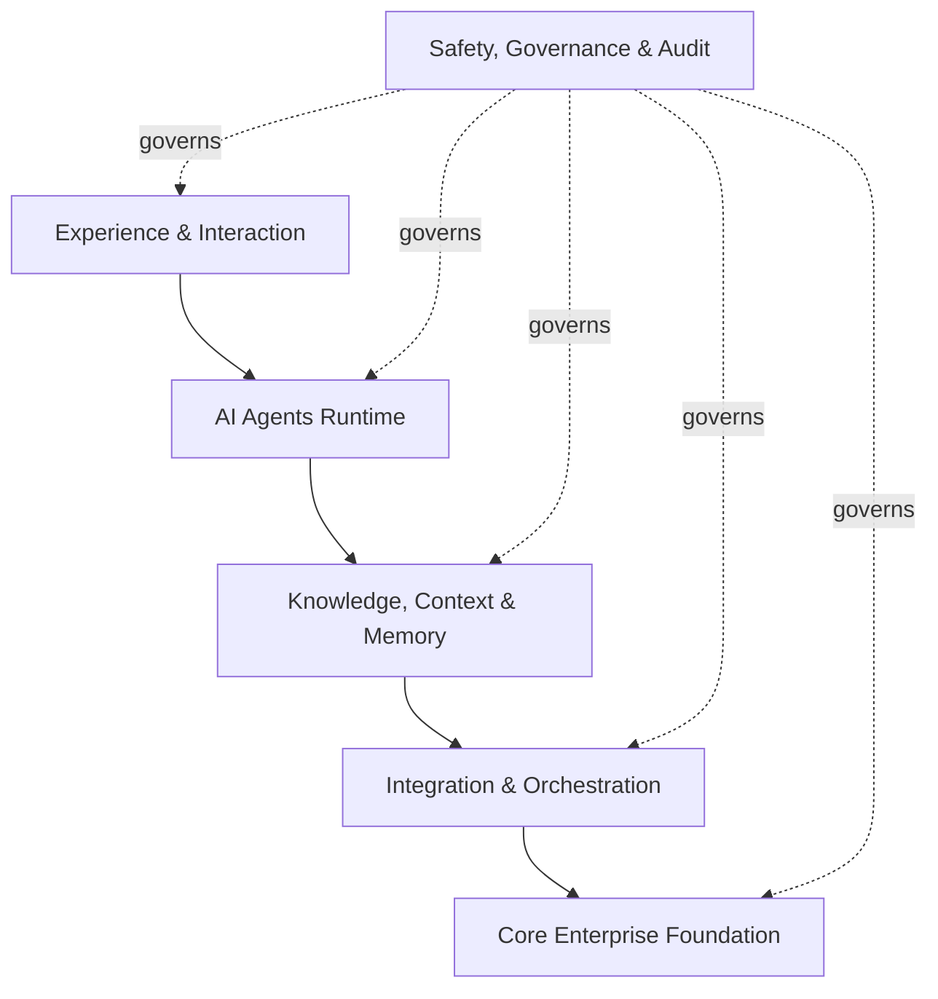

# Mostafa ElNagar

### AI & Software Engineering Executive · AI Architect · Product Engineering Leader

**Building agentic AI, enterprise software, cloud platforms, and intelligent ERP products from strategy to production.**

---

## Executive profile

I am an AI and software engineering leader with **20+ years of hands-on experience** across product development, enterprise architecture, cloud systems, ERP platforms, data, automation, and engineering management.

My work connects business strategy with practical delivery: defining products, designing architectures, leading multidisciplinary teams, modernizing legacy systems, integrating enterprise platforms, and taking AI-enabled solutions from concept to production.

I am the co-founder of **WytSky Cloud Solutions** and the product architect behind the evolving **SKY365 ecosystem**—an enterprise platform spanning ERP, AI, agentic workflows, integrations, knowledge, automation, and digital workforce capabilities.

> My principle: technology becomes valuable only when it improves how people decide, work, learn, and build.

---

## Current focus

<table>
<tr>
<td width="50%" valign="top">

### SKY365 Agentic Platform

- Agent runtime and orchestration
- Skills, tools, memory, and policy layers
- Knowledge Gateway and MCP integration
- Human-in-the-loop workflows
- Auditability, evaluation, and safety
- Enterprise deployment and private AI

</td>
<td width="50%" valign="top">

### Enterprise AI & Product Engineering

- AI strategy and solution architecture
- Agentic RAG and knowledge systems
- MLOps and AI lifecycle governance
- ERP and business process automation
- Cloud, on-premise, and hybrid deployment
- Product discovery, specification, and delivery

</td>
</tr>
</table>

```mermaid
flowchart LR
    A[Business Challenge] --> B[Product & AI Strategy]
    B --> C[Enterprise Architecture]
    C --> D[AI Agents + ERP + Integrations]
    D --> E[Secure Delivery & MLOps]
    E --> F[Measured Business Outcomes]
```

---

## Platform vision

```mermaid
flowchart TB
    UX[Experience & Interaction]
    AR[AI Agents Runtime]
    KT[Knowledge, Context & Memory]
    IO[Integration & Orchestration]
    CF[Core Enterprise Foundation]
    SG[Safety, Governance & Audit]

    UX --> AR
    AR --> KT
    KT --> IO
    IO --> CF
    SG -. governs .-> UX
    SG -. governs .-> AR
    SG -. governs .-> KT
    SG -. governs .-> IO
    SG -. governs .-> CF
```

---

## Core capabilities

| Domain | Capabilities |
|---|---|
| **AI & Agentic Systems** | AI agents, agentic RAG, LLM applications, prompt and context engineering, tools, skills, memory, evaluation, guardrails |
| **Architecture** | Enterprise architecture, distributed systems, microservices, APIs, event-driven integration, multi-tenant SaaS |
| **Product Engineering** | Product discovery, requirements, specifications, roadmaps, team leadership, SDLC, quality and release management |
| **Microsoft Stack** | C#, .NET, ASP.NET Core, Blazor, WebAssembly, MAUI, Xamarin, SQL Server, Azure, Microsoft 365, SharePoint |
| **Data & AI Engineering** | Python, machine learning, deep learning, data pipelines, analytics, Power BI, Tableau, SQL |
| **Enterprise Integration** | ERP, CRM, SAP, Oracle, REST, SOAP, XML, ETL, hybrid and legacy modernization |
| **Cloud & Operations** | Azure, AWS, Google Cloud, DevOps, CI/CD, containers, observability, on-premise and hybrid infrastructure |

---

## Career snapshot

- **WytSky Cloud Solutions / wytskyai** — Product Development Engineering Manager, Senior Director of Software Engineering, Software Engineering Team Lead
- **iSecureMind** — Senior Development Manager
- **Quantum IT Services** — Lead Software Development Engineer
- **Friends Gardens for Agricultural & Development** — Business Owner and CEO
- **SAS** — Lead, Senior, and Junior Software Engineer
- **Afaq Information Technology** — Junior Software Engineer

Across these roles, I have worked on enterprise resource planning, accounting, HR, CRM, manufacturing, healthcare, telecommunications billing, GPS and transportation, document management, business intelligence, mobile applications, cloud platforms, and AI-enabled products.

---

## Selected products and initiatives

### SKY365
A modular enterprise platform combining ERP, SaaS, AI, automation, integrations, analytics, and agentic capabilities.

### SKY365 Agentic
A digital workforce architecture built around agents, skills, tools, memory, knowledge, governance, and auditable business workflows.

### WytSky Cloud Solutions
Technology and product engineering for cloud, mobile, web, enterprise integration, analytics, and intelligent automation.

### Enterprise modernization
Long-term experience migrating desktop and legacy applications into web, cloud, mobile, API-first, and integrated enterprise platforms.

---

## Education and professional development

- **Master of Computer Applications** — Mansoura University
- **Bachelor of Engineering** — Computer Engineering and Automatic Control, Tanta University
- **Postgraduate Data Science & Machine Learning Program**
- **Project Management Professional (PMP)**
- Additional development in IT service management, HR, databases, C#, Python, cloud, AI, and software engineering

---

## Technology map

  

---

## GitHub activity

---

## Let us build something meaningful

I am open to serious collaboration in:

- Enterprise AI and agentic platforms
- AI transformation and architecture advisory
- ERP modernization and intelligent automation
- Product engineering and technical leadership
- Private, on-premise, and hybrid AI deployments

**Kuwait · Egypt · Finland · Global delivery**

[Website](https://saskw2010.github.io/) · [LinkedIn](https://www.linkedin.com/in/mostafa-a-elnagar/) · [WytSky](https://www.wytsky.com/) · [Email](mailto:m.nagar@wytsky.com)

