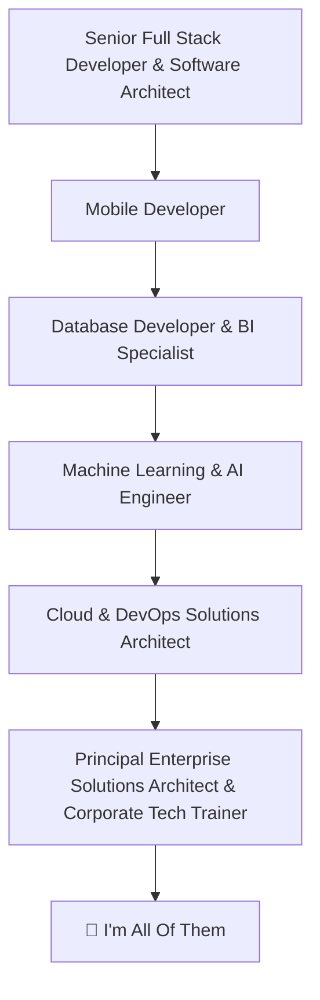

<div align="center">
  <h1>👋 Hi There, I’m Mostafa A. ElNagar (@saskw2010)</h1>
  <h3>
    👑 Principal Enterprise Solution Architect | Senior Full-Stack Developer | Machine Learning Engineer<br/>
    AI & Cloud Technical Specialist | Corporate Tech Trainer
  </h3>
</div>

<div id="header" align="center">
  
</div>

---

### 🌟 About Me & Core Philosophy

- 💡 **Interpersonal & Technical Excellence**: Highly passionate, creative, and dedicated leader with 20+ years of proven expertise delivering large-scale cloud services, mobile apps, enterprise ERPs, and applied AI/ML systems.
- 🎓 **Corporate Technical Coaching & Mentoring**: Mentoring senior engineering teams, executing hands-on technical labs, and building industry-ready curriculum in AI, Cloud, .NET, and Data Analytics.
- 📊 **PowerBI & Enterprise ERP Integration**: Designing executive PowerBI dashboards (`.pbix`), DAX metrics, and automated ETL pipelines integrated with ERPs (Healthy Meal ERP, KDC Oil & Gas Operations, POS).
- 🖨️ **Stimulsoft & Enterprise Reporting Engines**: Integrating complex PDF/Print report generation engines with Code On Time, ASP.NET WebForms, and SQL Server.
- 🔮 **Applied AI, RAG & Vector Databases**: Implementing Local DeepSeek LLMs, LangChain, Rasa NLU, and SQL Server 2025 Native Vector Search (`VECTOR_DISTANCE`).

---

## 🧭 Career Architecture Evolution


```mermaid
graph TD;
    A[Senior Full Stack Developer & Software Architect] --> B[Mobile Developer];
    B --> C[Database Developer & BI Specialist];
    C --> D[Machine Learning & AI Engineer];
    D --> E[Cloud & DevOps Solutions Architect];
    E --> F[Principal Enterprise Solutions Architect & Corporate Tech Trainer];
    F --> G[🚀 I'm All Of Them];
```

---

## 🏢 Corporate Leadership & Enterprise Experience

Over the past two decades, I have designed and delivered software architectures for leading international and regional corporations, including:

<div align="center">
  <h3>1️⃣ Zain Kuwait (MTC)</h3>
  <br/><br/>
  
  <h3>2️⃣ Schlumberger (SLB)</h3>
  <br/><br/>
</div>

---

## ⚡ Technical Skills & Technology Stack

```
Full Stack & Technologies Built:
- C# | VB.NET | CSS | JavaScript | TypeScript 🔥💜
- Blazor Server | Blazor WebAssembly (WASM) | .NET MAUI Hybrid 💜
- .NET 8 | .NET Core | ASP.NET MVC & WebForms 💜
- MAUI 🔥 | Xamarin 📱 | Flutter | iOS & Android Native SDKs
- Python 🐍 | PyTorch | LangChain | DeepSeek LLMs
- Windows Services | Microservices | REST APIs
- Agile Methodology & SDLC Leadership
- SharePoint Enterprise Intranet Portal Development
- SQL Server 2025 AI | PostgreSQL | Oracle | MySQL | MongoDB | Redis
- AWS | Azure | Google Cloud Services | Docker | Kubernetes
```

<div align="center">
  <br/>
  
</div>

<br/>

<div align="center">
                 
</div>

---

## 🏛️ Featured Standalone Repositories & Case Studies

| Category | Repository / Project | Architecture & Highlights | Visibility |
|---|---|---|---|
| 🤖 **AI & Local LLM** | 🤖 [`gradio-deepseek-chatbot`](https://github.com/saskw2010/gradio-deepseek-chatbot) | Local DeepSeek LLM + LangChain + Gradio Docker Container | **Public** 🌐 |
| 🗄️ **Modern SQL** | 🚀 [`Modern_SQL_Server_AI_Master_Guide`](https://github.com/saskw2010/Modern_SQL_Server_AI_Master_Guide) | SQL Server 2025 AI Vector Search, Graph Tables & Ledger | **Public** 🌐 |
| 📜 **Fatwa Workflow** | 📜 [`fatwa-workflow`](https://github.com/saskw2010/fatwa-workflow) | Enterprise Fatwa Workflow Platform with AI Vector Search & Ledger | **Public** 🌐 |
| 🤖 **n8n Automation** | 🤖 [`n8n_AI_Automation_Workflows`](https://github.com/saskw2010/n8n_AI_Automation_Workflows) | n8n Workflows with Google Vision OCR & Gemini LLM Pipelines | **Public** 🌐 |
| 📱 **MAUI Hybrid** | 📱 [`Blazor_MAUI_Hybrid_Mobile_App`](https://github.com/saskw2010/Blazor_MAUI_Hybrid_Mobile_App) | Hybrid Blazor UI + .NET MAUI Native Cross-Platform App | **Public** 🌐 |
| 📈 **AWS Big Data** | 📊 [`AWS_Ecommerce_Analytics_Platform`](https://github.com/saskw2010/AWS_Ecommerce_Analytics_Platform) | AWS Kinesis + PySpark + Glue + Redshift Analytics | **Public** 🌐 |
| 🔮 **AI & NLP** | 🔤 [`NLP_Text_Classification_Engine`](https://github.com/saskw2010/NLP_Text_Classification_Engine) | Modular Python Text Classification & Sentiment Analysis | **Public** 🌐 |
| 🔮 **AI & NLU** | 💬 [`Rasa_NLU_Conversational_AI`](https://github.com/saskw2010/Rasa_NLU_Conversational_AI) | Rasa NLU Intent Recognition & Dialogue Engine | **Public** 🌐 |
| 🌐 **Blazor SPA** | 🎫 [`Blazor_Enterprise_HelpDesk`](https://github.com/saskw2010/Blazor_Enterprise_HelpDesk) | IT Incident Ticket Management with Radzen UI | **Public** 🌐 |
| 🌐 **Blazor WASM** | 💼 [`Blazor_CRM_Wasm_System`](https://github.com/saskw2010/Blazor_CRM_Wasm_System) | Single Page App CRM & Sales Pipeline Tracker | **Public** 🌐 |
| 🥗 **Public Health** | 🥗 [`Food_Authority_Compliance_Platform`](https://github.com/saskw2010/Food_Authority_Compliance_Platform) | Kuwait Public Authority for Food Safety Compliance Repo | **Private** 🔒 |
| 📱 **Mobile Store** | 🛒 [`WytSky_Store_Mobile_App`](https://github.com/saskw2010/WytSky_Store_Mobile_App) | .NET MAUI / Xamarin Retail Mobile App with Knet Payment | **Private** 🔒 |
| 🛢️ **PowerBI & ERP** | 📊 [`KDC_OilGas_Rig_Operational_Analytics`](https://github.com/saskw2010/KDC_OilGas_Rig_Operational_Analytics) | KDC Rig Moves, NPT Downtime & PowerBI DAX Platform | **Private** 🔒 |
| 🛒 **Retail POS** | 🛒 [`WytSky_POS`](https://github.com/saskw2010/WytSky_POS) | Restaurant & Store POS with Barcode & Thermal Print | **Private** 🔒 |
| 💳 **FinTech** | 💳 [`WytSky_Knet_Gateway`](https://github.com/saskw2010/WytSky_Knet_Gateway) | Kuwait Knet Payment Gateway C# SDK (.NET 4.8 / iPayPipe) | **Private** 🔒 |
| 📱 **Telecom SMS** | 📱 [`WytSky_SMS_Gateway`](https://github.com/saskw2010/WytSky_SMS_Gateway) | SMS Integration Library for Telecom (STC, Zain, Ooredoo) | **Private** 🔒 |
| 📧 **Windows Service** | 📧 [`WytSky_Email_Automation_Service`](https://github.com/saskw2010/WytSky_Email_Automation_Service) | Daemon Service for HTML Email Templates & PDF Reports | **Private** 🔒 |

---

## 📊 Live GitHub Engineering Metrics

<div align="center">
  [](https://git.io/streak-stats)
  [](https://github.com/anuraghazra/github-readme-stats)
  <br/>
  
</div>

---

## 📸 Media Gallery & Branded Engineering Portfolio

<div align="center">
  <br/><br/>
  <br/><br/>
  <br/><br/>
  <br/><br/>
  <br/><br/>
  <br/><br/>
  
</div>

---

## 🛠️ Tasks, Duties and Responsibilities (TDR)

- **Software Architecture & SDLC Leadership**: Modify existing software to adapt to new hardware, upgrade interfaces, and improve performance using scientific analysis and mathematical models.
- **Enterprise ERP & BI Applications**: Develop ASP.NET (WebForms / MVC / Blazor) ERP applications and self-contained Stimulsoft / SSRS business intelligence dashboards.
- **SharePoint Intranet Systems**: Build SharePoint intranet portals to serve as information and business process platforms across subsidiaries.
- **System Integration & Testing**: Formulate and conduct extensive test plans, compute system reliability, and maintain robust object-oriented software contracts.

---

## 🌐 Connect & Contact Badges

<div id="badges" align="center">
  <a href="mailto:saskw2010@gmail.com">
    
  </a>
  <a href="https://www.linkedin.com/in/mostafa-a-elnagar" target="_blank">
    
  </a>
  <a href="https://saskw2010.github.io/saskw2010-portfolio/" target="_blank">
    
  </a>
  <a href="https://www.youtube.com/channel/UCgnV-yHUyAN6y2amvdxF2oQ" target="_blank">
    
  </a>
  <a href="https://twitter.com/wyt_sky" target="_blank">
    
  </a>
</div>

<br/>

<div id="header" align="center">
  
</div>

---

<div align="center">
  <i>🌟 Dedicated to Engineering Excellence, Continuous Innovation & Knowledge Sharing.</i>
</div>
